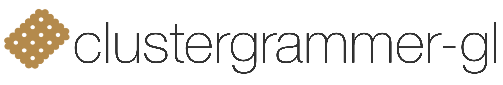

<!-- # clustergrammer -->
<!-- #  -->

The Clustergrammer-GL repo contains the *in-development* WebGL/[regl](http://regl.party/) version of [Clustergrammer](https://github.com/MaayanLab/clustergrammer). See [live example](https://ismms-himc.github.io/clustergrammer-gl/).

## Citing Clustergrammer
Please consider supporting Clustergrammer by citing our publication:

Fernandez, N. F. et al. Clustergrammer, a web-based heatmap visualization and analysis tool for high-dimensional biological data. Sci. Data 4:170151 doi: [10.1038/sdata.2017.151](https://www.nature.com/articles/sdata2017151 ) (2017).

## Licensing
Clustergrammer-GL is being developed by the [Human Immune Monitoring Center](https://icahn.mssm.edu/research/human-immune-monitoring-center) and [Ma'ayan lab](http://labs.icahn.mssm.edu/maayanlab/) at the [Icahn School of Medicine at Mount Sinai](http://icahn.mssm.edu/). More information about Clustergrammer's license can be found at [Clustergrammer License](https://clustergrammer.readthedocs.io/license.html).

Please [contact us](http://clustergrammer.readthedocs.io/#funding-and-contact) for support, licensing questions, comments, and suggestions.
